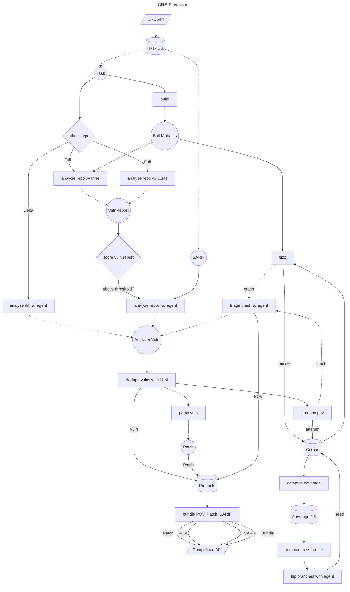

# CRS Architecture

```mermaid
---
title: CRS Flowchart
---
graph TD
    %% APIs
    CRSAPI[/CRS API/]
    CompetitionAPI[/Competition API/]


    %% DBs
    TaskDB[(Task DB)]
    CoverageDB[(Coverage DB)]
    Corpus[(Corpus)]
    Products[(Products)]

    %% Data types
    Task((Task))
    Artifacts((BuildArtifacts))
    VulnReport((VulnReport))
    AnalyzedVuln((AnalyzedVuln))
    Patch((Patch))
    SARIF((SARIF))


    %% Processes
    Build[build]
    Fuzz[fuzz]
    Type{check type}
    Infer[analyze repo w/ Infer]
    AInalyze[analyze repo w/ LLMs]
    Diff[analyze diff w/ agent]
    Score{score vuln report}
    VulnAnalyze[analyze report w/ agent]
    POVProduce[produce pov]
    GenPatch[patch vuln]
    LLMTriage[triage crash w/ agent]
    Coverage[compute coverage]
    Frontier[compute fuzz frontier]
    BranchFlip[flip branches with agent]
    DedupeVuln[dedupe vulns with LLM]
    Bundle[bundle POV, Patch, SARIF]

    %% Edges
    CRSAPI --> TaskDB
    TaskDB -.-> Task
    TaskDB -.-> SARIF
    Task --> Build -.-> Artifacts

    Fuzz -- minset --> Corpus
    Fuzz -. crash .-> LLMTriage

    Task --> Type -- Full --> Infer -.-> VulnReport
             Type -- Full --> AInalyze -.-> VulnReport
             Type -- Delta --> Diff -.-> AnalyzedVuln

    Artifacts --> Fuzz
    Artifacts --> Infer

    VulnReport --> Score -- above threshold? --> VulnAnalyze -.-> AnalyzedVuln
    SARIF --> VulnAnalyze

    AnalyzedVuln --> DedupeVuln

    DedupeVuln --> POVProduce -- attempt --> Corpus
                   POVProduce -. crash .-> LLMTriage
    DedupeVuln -- Vuln --> Products
    DedupeVuln --> GenPatch -.-> Patch

    LLMTriage -.-> AnalyzedVuln


    Corpus --> Fuzz
    Corpus --> Coverage --> CoverageDB --> Frontier --> BranchFlip -- seed --> Corpus

    Patch -- Patch --> Products
    LLMTriage -- POV --> Products
    Products --> Bundle -- Patch --> CompetitionAPI
                 Bundle -- POV --> CompetitionAPI
                 Bundle -- SARIF --> CompetitionAPI
                 Bundle -- Bundle --> CompetitionAPI
```